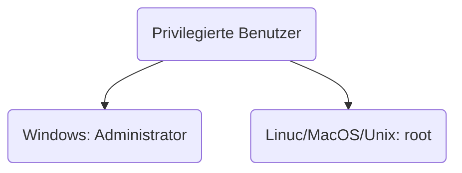
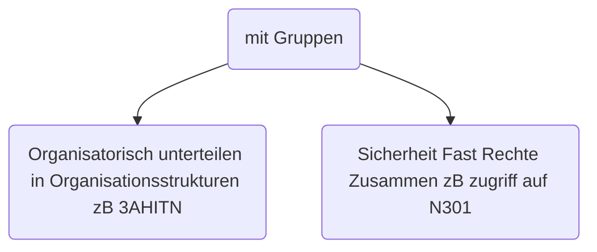

---
tags:
  - 3te_Klasse
  - itsi
date: 2024-11-14T00:57:00
---

- Priveligierte Benutzer
	- um Konfigurationen am System durchzufüher

- unpriveligierte Benutzer -> müssen manuell erstellt werden
	- um Anwendungen ausführen
	- können durch priveligierte Nutzer Rechte erhalten

- Service Nutzer
	- haben nur die Rechte für bestimmte Diente
		zB. HTTP-Server

## Nutzeraufteilung
- Personenbezogene Nutzer -> gehören zu GENAU EINER natürlichen Personen
- [+] Nur eine Person kennt PW
- [+] Eindeutige Zuordenbarkeit
	(wir können eindeutig zuordnen wer was gemacht hat)
- geteilte Nutze
- [+] weniger Lizenzkosten (meist Illegal!)
- [-] PW wissen mehr Personen falls es vergessen wird
- [ ] kann missbraucht werden
- [ ] gleichzeitige Nutzung nicht möglich

Wie können Nutzer zusammengefasst werden

Gruppen können aus mehreren Nutzern und weiteren Gruppen bestehen
	Sie werden verschachtelt

ITEL
	==3AHITN== -> Zugriff auf N301
	==3AHITM==
	==Lehrer:innen==
		ZIVK
		ANGE
		SHEL