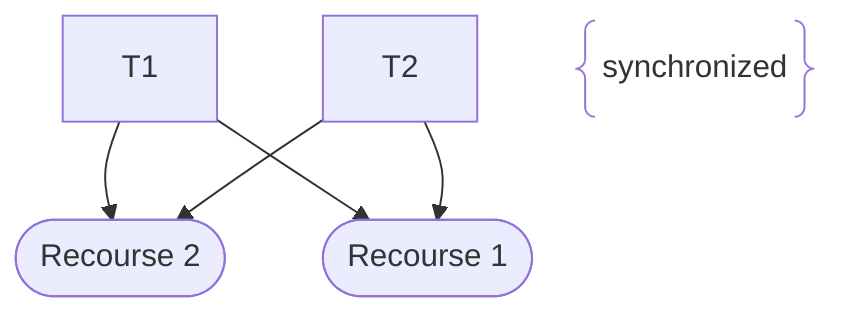

---
tags:
  - 4te_Klasse
  - sew
date: 2025-09-12T13:45:00
---

![[Threads 2025-09-12 14.02.52.excalidraw]]
1) was ist ein Thread
	asd
2) wie erstellt man einen Thread 
```java
class MeinThread extends Thread
```
3) welche Methode wird überschrieben
```java 
run()
```
4) Thread erzeugen
```java
MeinThread t1 = new MeinThread();
```
	-> Zustand Bereit 
5) Starten
```java
t1.start();
```
6) falsches starten
```java
t1.run(); //läuft nicht als Thread nicht Parallel!!
```
7) wann ist ein Thread beendet
	1) run() beendet
	2) Programm Beendet
	3) interrupt() //-s-t-o-p-
8) was join()
ein Thread wartet bis der andere Thread beendet ist

2\. Möglichkeit
class MeinThread extends BB implements Rumble
9) Dadlock

asd