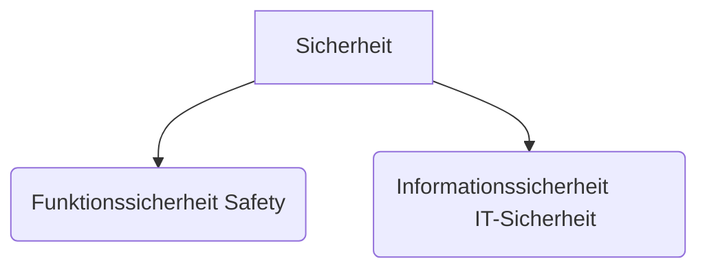

---
tags:
  - itsi
  - 4te_Klasse
---

## Schutzziele der IT-Sicherheit:

1) Vertraulichkeit (Confidentiality)
		- Schutz vor unbefugter Informationsgewinnung
	Maßnahmen:
	- Verschlüsselung
	- (Authentifizierung)
	- Zugriffskontrolle
	- Kontrolle von Informationsflüssen -> WER kriegt WELCHE Info?
	- Sicherheitsklassifikation
2) Integrität (Integrity)
		- Schutz vor unbefugter und unbemerkter Manipulation von Daten
	Maßnahmen:
	- Protokollierung (von Änderungen /Zugriffen)
	- Prüfsumme (z.B. Hash)
	- Zugriffskontrolle
	- digitale Signatur
3) Verfügbarkeit (Availability)
		- Schutz vor Ausfall / (unauthorisierter) Beeintrechtigung von Daten/Komponenten/Diesnsten
	Maßnahmen:
	- Redundanz
	- Monitoring (Systemnutzung & Ressourcengebrauch überwachen)
	- Protokollieren v. Nutzeraktivitäten 
