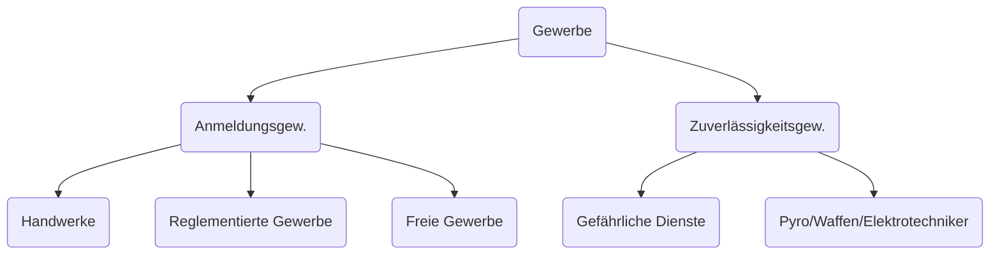

---
tags:
  - recht
  - 5te_klasse
  - unternehmens-recht
created: 2026-09-24T11:58:50+02:00
modified: 2026-09-24T12:59:01+02:00
---
GWO... Gewerbeordnung
Gewerbe sind tätigketien die 
1. _gewerbsmäßig_ ausgeübt werden
2. nicht gesetzlich verboten sind
3. keine ausdrücklich ausnahme vom anwendungsbereich der GWO verboten sind
	1. Freie Berufe (keine Gewerbe) (ärzte, apotheker, rechtsanwälte, künstler...)
	2. Verfassungsrechtlichen gründen (Kino(Lichtspielhäuser) betreiber)

eine Tätigkeit die regelmäßig, selstständig, und in ertragsabsicht ausgeübt wird

allgemeine vorraussetzungen
1. Gewerberecht Handlungsfähigkeit
	1. Geschäftsführer: Stellverträter, Natürliche person der alle vorraussetzunge erfüllt und einschreiten kann
2. Unbeschollenheit i.w.S.
	1. U:eS (Freies Strafregister)
	2. keine Insolvenz
	3. Keine Entziehungen GB
3. Staatsbürgerschaft (Gleichstellungsentscheidung)
4. Standordbindung (Zentrale/Adresse)